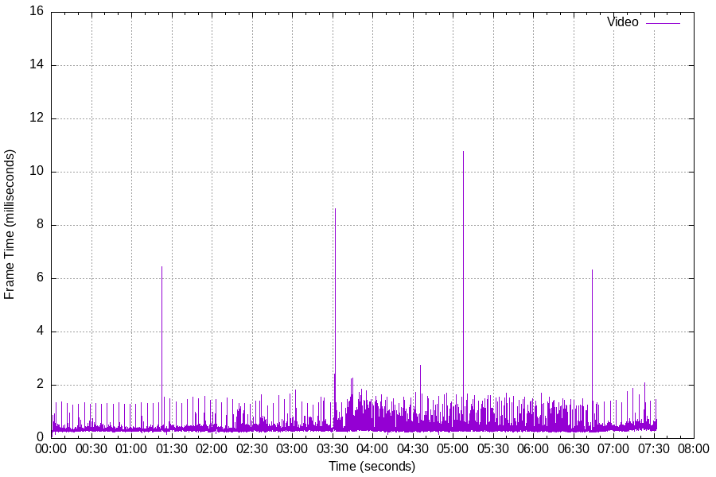
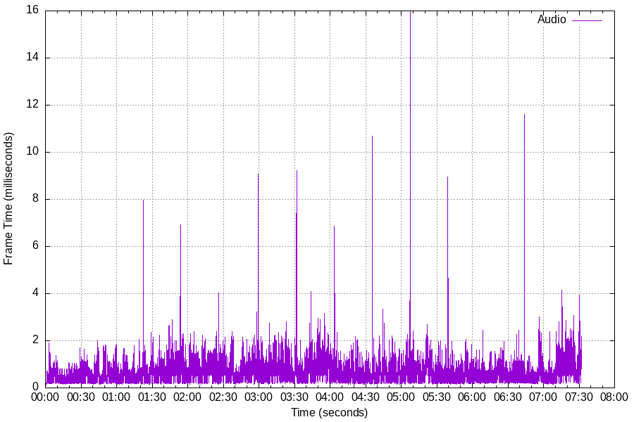
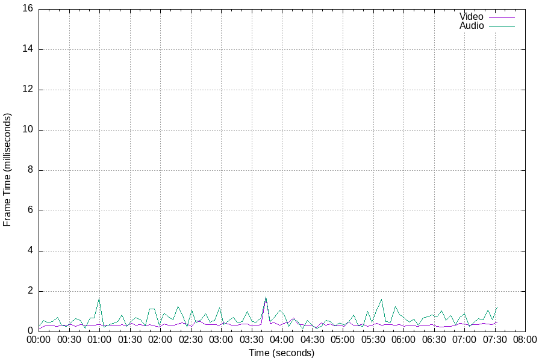
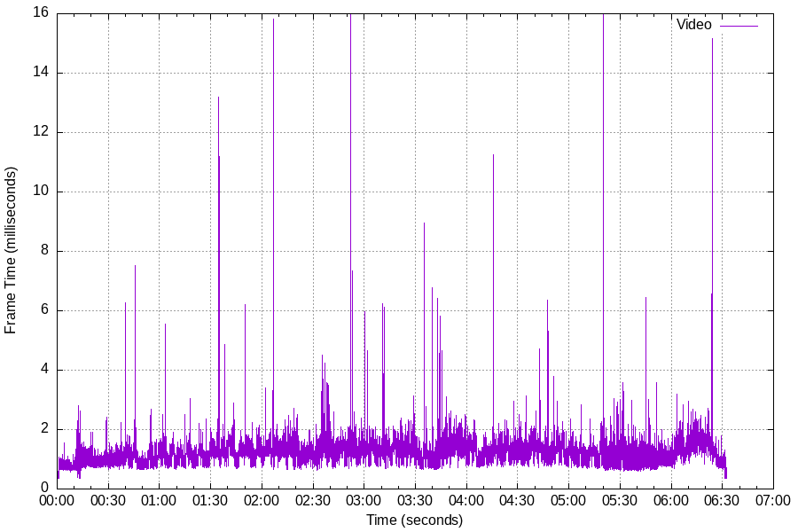
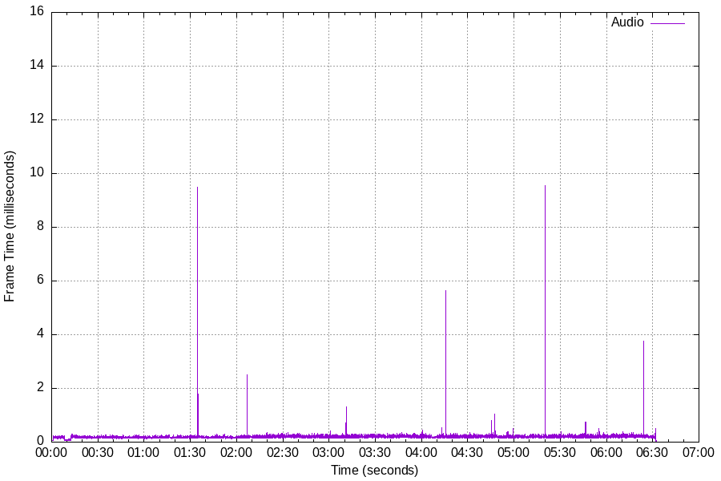
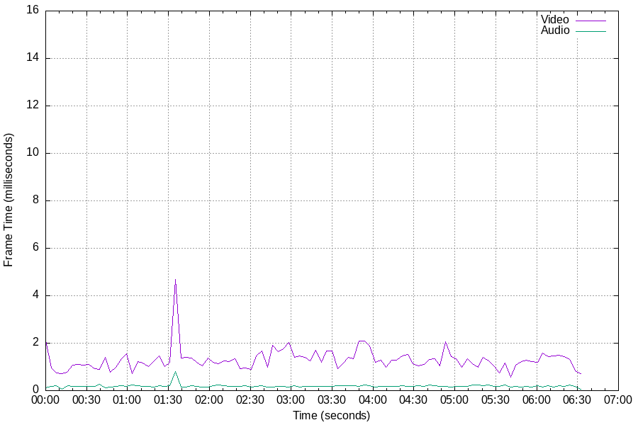

## Performance

- [Test Parameters](#1-test-parameters)
  * [Host Specification](#11-capture-host-specification)
  * [Game Settings](#12-game-settings)
  * [Capture Settings](#13-capture-settings)
  * [Captured Media](#14-captured-media)
  * [Capture Metrics](#15-capture-metrics)
- [X11](#2-x11)
  * [Results](#21-results)
  * [Visualization](#22-result-visualization)
- [Wayland](#3-wayland)
  * [Results](#31-results)
  * [Visualization](#32-result-visualization)

### 1. Test Parameters
My current go-to test for *Shadow Cast* is the game *Ghostrunner*. This game is very fast-paced with lots of visual movement so it seems to drive the video encoder pretty hard. Also, it has very low latency audio meaning the audio stream will be delivered in very small audio packets (~128 samples).

All metrics have been collected by compiling *Shadow Cast* with the (now obsolete) `-DSHADOW_CAST_ENABLE_METRICS=ON` CMake configuration option. Running the application with this option enabled will emit a supplementary data file in the media output directory in *csv* format. Each metric row is a data point describing how long it took to process the frame. This data contains...

- Metric category, either video or audio
- Frame no. (video) / Current sample no. (audio)
- Timestamp in nanoseconds.
- Time taken to process the frame, in nanoseconds

It should be noted that audio and video frames are captured in their own separate threads, so the frame time results for audio and video frames are not cumulative. The threads do have to synchronize access to the output media so there is the possibility that _some_ blocking occurs.

#### 1.1 Capture Host Specification
- AMD Ryzen 7 5700G
- NVIDIA RTX 3080Ti GPU, 12GB VRAM
- 16GB RAM
- SSD storage
- VoidLinux, Kernel 6.5.11\_1

#### 1.2 Game Settings
- 60fps frame limit
- Raytracing enabled
- DLSS set to "quality" setting
- Output resolution set to 2560x1440

#### 1.3 Capture Settings
- FFMpeg/libav version: 4.4.4
- Video: 60fps, hevc\_nvec encoder, "p5" preset, 2560x1440 resolution
- Audio: 48,000Hz, 2-ch stereo, Opus encoder

#### 1.4 Captured Media

The media provided here was captured on X11. The Wayland capture session is very similar so it is not provided.

<details>
<summary>FFProbe output</summary>

```
ffprobe version 4.4.4 Copyright (c) 2007-2023 the FFmpeg developers
  built with gcc 12.2.0 (GCC)
  configuration: --prefix=/usr --disable-debug --enable-gpl --enable-gnutls --disable-stripping --enable-libcdio --enable-version3 --enable-runtime-cpudetect --enable-libmp3lame --enable-libvorbis --enable-libxvid --enable-libx264 --enable-libvpx --enable-libtheora --enable-shared --enable-static --enable-libxcb --enable-libpulse --enable-libfreetype --enable-libmodplug --enable-libspeex --enable-libcelt --enable-libass --enable-libopus --enable-librtmp --enable-libjack --disable-libopencore_amrnb --disable-libopencore_amrwb --disable-libopenjpeg --enable-postproc --enable-opencl --enable-libvmaf --enable-libx265 --enable-libv4l2 --enable-libaom --enable-vaapi --enable-vdpau --enable-libbs2b --enable-avresample --enable-libvidstab --enable-libdav1d --disable-libzimg --enable-libwebp --disable-libmysofa --enable-vulkan --enable-libdrm --enable-libsvtav1 --enable-libsrt --enable-librist --enable-nvenc --enable-nvdec
  libavutil      56. 70.100 / 56. 70.100
  libavcodec     58.134.100 / 58.134.100
  libavformat    58. 76.100 / 58. 76.100
  libavdevice    58. 13.100 / 58. 13.100
  libavfilter     7.110.100 /  7.110.100
  libavresample   4.  0.  0 /  4.  0.  0
  libswscale      5.  9.100 /  5.  9.100
  libswresample   3.  9.100 /  3.  9.100
  libpostproc    55.  9.100 / 55.  9.100
Input #0, mov,mp4,m4a,3gp,3g2,mj2, from 'gr-test.mp4':
  Metadata:
    major_brand     : isom
    minor_version   : 512
    compatible_brands: isomiso2mp41
    encoder         : Lavf58.76.100
  Duration: 00:07:51.78, start: 0.000000, bitrate: 123479 kb/s
  Stream #0:0(und): Audio: opus (Opus / 0x7375704F), 48000 Hz, stereo, fltp, 118 kb/s (default)
    Metadata:
      handler_name    : SoundHandler
      vendor_id       : [0][0][0][0]
  Stream #0:1(und): Video: hevc (Rext) (hev1 / 0x31766568), yuv444p(tv), 2560x1440 [SAR 1:1 DAR 16:9], 123350 kb/s, 60 fps, 60 tbr, 90k tbn, 60 tbc (default)
    Metadata:
      handler_name    : VideoHandler
      vendor_id       : [0][0][0][0]
```

</details>

Here is a YouTube link to the captured media used for this test...

[](https://www.youtube.com/watch?v=UEIIrn50KB8)

_NOTE: The accompanying video here has been shortened from the original_

#### 1.5 Capture Metrics

The metrics provided were captured on X11 and are only provided to indicate the data set. The Wayland data set is not provided.

[Metrics data file](data/ghostrunner.mp4.metrics)

Fields:

| Index     | Description                                       |
|---------  |-------------------                                |
| 0         | Metric category. `1` is video, `2` is audio       |
| 1         | Frame / Sample number                             |
| 2         | Timestamp in nanoseconds                          |
| 3         | Time to process frame, in nanoseconds             |
| 4         | Sample count (not used / set to `1` for video)    |
| 5         | No. of media packets processed in this frame      |

### 2. X11
Capturing on X11 uses NVIDIA's NvFBC (Frame Buffer Capture) SDK.

#### 2.1 Results

Average time to process frame:

* Video: 0.375ms
* Audio: 0.662ms

Percentiles:

| Percentile    | Video             | Audio             |
|----------     |---------------    |-----------------  |
| 99.99         | 6.337ms           | 9.213ms           |
| 99            | 1.139ms           | 1.913ms           |
| 90            | 0.469ms           | 1.124ms           |
| 50            | 0.343ms           | 0.571ms           |

#### 2.2 Result Visualization

Detailed video frame times:


Detailed audio frame times:


Smoothed combined audio & video:


### 3. Wayland

#### 3.1. Results

Average time to process frame:

* Video: 1.228ms
* Audio: 0.191ms

Percentiles:

| Percentile    | Video             | Audio             |
|----------     |---------------    |-----------------  |
| 99.99         | 15.149ms          | 5.644ms           |
| 99            | 2.178ms           | 0.295ms           |
| 90            | 1.636ms           | 0.234ms           |
| 50            | 1.185ms           | 0.184ms           |

#### 3.2. Result Visualization

Detailed video frame times:


Detailed audio frame times:


Smoothed combined audio & video:

